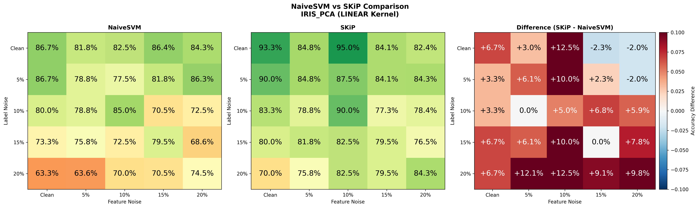

# SKiP - SVM with K-nearest neighbor and Probabilistic weighting

<a href="https://github.com/hoonably/SKiP"></a>
<a href="https://hoonably.github.io/SKiP"></a>

**🤝 Contributors** 
- Jeonghoon Park · [@hoonably](https://github.com/hoonably)
- KangJun Lee · [@suri7897](https://github.com/suri7897)
- Jaemin Kim · [@ginjae](https://github.com/ginjae)
- Doyeol Oh · [@ohdoyoel](https://github.com/ohdoyoel)

---



Robust SVM classifier implementation with noise-resistant weighting schemes. SKiP combines K-nearest neighbor distance weighting with probabilistic confidence scoring to improve classification performance on noisy datasets.

## 🎯 Overview

This project implements and compares four SVM variants:
- **NaiveSVM**: Standard soft-margin SVM baseline
- **ProbSVM**: Probabilistic weighting based on class probabilities
- **KNNSVM**: K-nearest neighbor distance-based weighting
- **SKiP**: Combined KNN and probabilistic weighting (proposed method)

Experiments are conducted on 4 datasets (Iris, Wine, Breast Cancer, Titanic) with both original and PCA-reduced features, using Linear and RBF kernels under various noise conditions (Type I boundary noise: 5%, 10%, 15%, 20%).

## 🚀 Quick Start

### 1. Environment Setup

```bash
conda create -n skip python=3.10
conda activate skip
pip install -r requirements.txt
```

### 2. Dataset Preparation

```bash
cd datasets
python download.py          # Download datasets
python make_noise_fast.py   # Generate noisy variants
cd ..
```

### 3. Run Experiments

```bash
# Main SVM experiments (NaiveSVM, ProbSVM, KNNSVM, SKiP)
python run_experiments.py

# Baseline comparisons (KNN, Decision Tree, Logistic Regression)
python run_baselines.py
```

### 4. Generate Visualizations

```bash
cd visualizations
python visualize_comparison.py          # Model comparison charts
python visualize_heatmaps.py            # Noise robustness heatmaps
python visualize_heatmaps_selected.py   # Selected heatmap grids
python visualize_support_vectors.py     # Support vector analysis
python visualize_decision_boundary.py   # Decision boundary plots
```

## 📊 Results

All experimental results are saved in:

`results`
- `model_comparison_results.csv` - SVM variant comparison
- `baseline_comparison_results.csv` - Comparison with KNN, Decision Tree, Logistic Regression
- `support_vector_comparison.csv` - Support vector analysis

`visualizations` - Performance charts and heatmaps
- `comparison` - Model performance comparison charts
- `noise_heatmap` - Robustness analysis across noise levels
- `noise_heatmap_selected` - Curated heatmap visualizations
- `support_vector` - Support vector count analysis


## 📁 Project Structure

```
SKiP/
├── models/
│   ├── svm_models.py      # NaiveSVM, ProbSVM, KNNSVM, SKiP implementations
│   └── multi_svm.py       # Multi-class SVM wrapper
├── datasets/
│   ├── download.py        # Dataset download script
│   └── make_noise_fast.py # Noise injection script
├── visualizations/        # Visualization scripts and outputs
├── results/               # Experimental results (CSV)
├── docs/                  # Github Page
├── run_experiments.py     # Main experiment runner
├── run_baselines.py       # Baseline comparison runner
└── datasets.py            # Dataset utilities
```